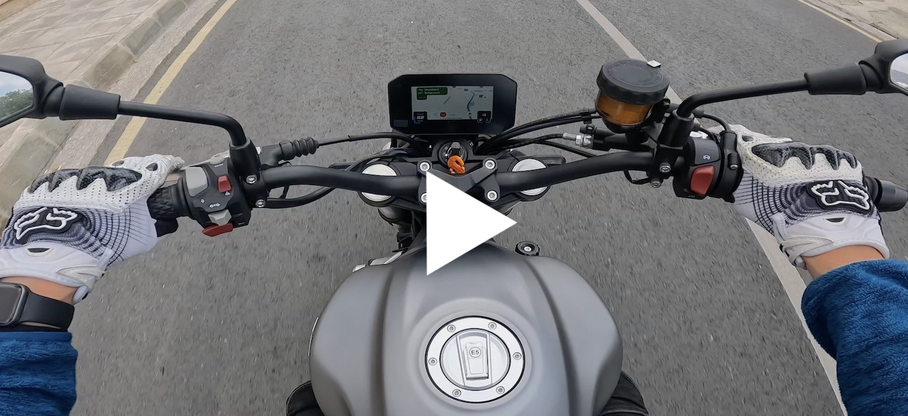

# Screen mirroring on Voge 500AC motorcycle

So, if you got the bike and noticed Wi-Fi connection isn't used for anything – you are not alone! Hopefully this guide will help you to get something working. This is the result of my (ongoing) research on how to stream from the mobile phone to the dashboard.

I have zero knowledge about other motorcycles, but a similar approach might work for you.

Please give this repo a star if it's helpful and consider backing me on [patreon](https://patreon.com/ReDetection).

## I am an Android user

Good for you! There are some YouTube videos with exactly the model of the bike, which have the missing QR-code close up nice and readable. So you can just scan this QR-code or follow this link to download the app directly from the manufacturer. The original QR code can be found at the very bottom of the http://www.carbit.com.cn/solution_international page.

Here be dragons! Be aware, since it is not the Google Play Store, but some chinese website with some chinese app – so god knows what did they put inside. It might be wise to install the app into a trusted sandbox environment, or at least have it far from your banking or cryptowallet apps.

Once you have the app, you can just connect to the motorcycle's Wi-Fi (iOS network works just as fine without any hotspot nonsense), open the app and use the right-side floating menu to establish a connection. Wi-Fi option in the menu worked fine for me, but if you need another QR-code – please subscribe to the repo, I will push the update soon.

## I am an iOS user

Well, there is some trickery. While you can still use the QR-code above or just [follow the link](https://apps.apple.com/cn/app/亿连lite/id1584935761), it won't open the App Store, because at the moment the app is only available in mainland China, unfortunately. So you have to create another Apple ID in your country region, then (and only then!) change the App Store region to mainland China.

To install the app on the iOS device, you need to log in the App Store with the new chinese account you just created. There is no need to remove the entire Apple ID, so you can keep your device perfectly operational, with all the pictures and apps in place. From the iOS device, open the Settings app -> Apple ID -> tap the Media & Purchases to Log Out from the App Store. Once you did that, open the App Store app and log in with the chinese account you have created. Then you can follow the link (I have also [QR code](2.ios-app-link.png) for that) to download the app from the App Store. With the app installed, you can again use the Settings app to relogin App Store account with your normal Apple ID.

Once you have the app, you can just connect to the motorcycle's Wi-Fi, open the app and use the right-side floating menu to establish a connection. For some reason, Wi-Fi discovery did not work for me, so I had to craft another QR-code to instruct the app to connect. 

Sometimes screen sharing stops for no reason – just press the up button on the left instrument cluster twice, this usually helps to resume streaming.

# Dear manufacturer & dealerships

Please consider this as a complaint! Fix the delivery chain, publish the app in all the regions, include a link to the app in the owner's manual and advertise the feature

#### How things should work

In the ideal world, there should be a link in the owner's manual, but having a QR code on the motorcycle instrument dashboard itself would also be nice. This way one can easily discover the needed software, open it up and have everything running. 

I assume, at the moment, this only works for the motorcycles sold in mainland China. So please fix that! Having navigation software (or screen mirroring) – is a very advanced feature, so this can be used as an advantage in the modern motorcycle market. Do not miss the chance while you still have the advantage!

#### How things actually work

Instrumentation only shows Wi-Fi settings (a static SSID and password! 🤦‍♂️) and nothing really changes if you connect it. There are some apps like EasyConnect and EasyRide which are in fact use the same protocol, does not seem not work, even if you find the correct QR-code.
